# Linux-management
# 2025-01-19
- Bikas Basyal, amk1002350@student.hamk.fi

# Task
How to create a virtual machine to used Azure Platform for Linux Management Course.

- Step 1: At first, I create a Azure account from portal.azure.com for myself using my university email. 


![Azure View after login ] 
-1.png>)

- Step 2: I created a new resource group  and new virtual machine in Azure portal.

- Step 3: I selected North Europe as a Region and Ubuntu Server 24.04 LTS - x64 Gen2 as the operating system. 

- Step 4: I selected the virtual machine size as Standard_B2ls_v2- 2 vCPUs, 4 GiB Memory ($33.29/month).

- Step 5: I selected the network configuration as Public IP address and Network interface and created a new Username (b_kas).

- Step 6: I seleceted OS disk type as Standard SSD and Storage type as Locally-redundant storage.

- Step 7: I selected the public IP address as Static and created a new public IP address as lab-robotics-ip.

- Step 8: I selected inbound ports as (Http(80), HTTPS(443), SSH(22))

- Step 9: I selected the Enable auto-shutdown and set the auto-shutdown time as 2:00 AM and Select the time Zone as (UTC + 3:00) Helsinki

- Step 10: I reviewed the settings and created the virtual machine.

After creating the virtual machine, I go to lab-robotics-ip and select setting(Configuration) than type bkas-lab-robotics as DNS name lable and save it.

- Step 11: After that, I select lab-robotics and select connect and select Native SSH and copy the path that I downloaded the key.pam file.


- Step 12: I open the terminal and paste the URL given in SSH to VM with specified private key.

![Successfully done in Terminal ]
-1.png>) 


# Creating Users Tupu (Using) To create the user tupu, use the following command: 
         sudo adduser tupu

This will:
1.Create a new user tupu.

2.Automatically create the home directory /home/tupu.

3.Set the default shell to /bin/bash.

4.Prompt for password creation and additional user details.

 # Tupu (Using) To create the user lupu, use the following command:

            sudo useradd -m -d /home/lupu -s /bin/bash -G lupu lupu

This will:

1.Create the user lupu

2.Set the home directory to /home/lupu

3.Assign the default shell /bin/bash

4.Add lupu to the lupu group            

# Set a password for lupu:

            sudo passwd lupu


Hupu (System User) To create a system user hupu with restricted login, use:            

            sudo useradd --system --shell /bin/false hupu

Granting Sudo Privilege Method 1: Using (Recommended) Edit the sudoers file safely:  
                sudo visudo  

Method 2: Adding Users to the Group Alternatively, run:

                sudo usermod -aG sudo tupu
                sudo usermod -aG sudo lupu

Verify with:

            groups tupu
            groups lupu

3.Setting Up Shared directory Step 1: Create the directory

         sudo mkdir /opt/projekti

Step 2: Create and Assign a Group

            sudo groupadd projekti
            sudo usermod -aG projekti tupu
            sudo usermod -aG projekti lupu

Step 3: Set Directory Ownership

            sudo chown :projekti /opt/projekti

Step 4: Set Permissions

            sudo chmod 770 /opt/projekti

Step 5: Ensure New Files Inherit Group Ownership

            sudo chmod g+s /opt/projekti

This ensures that new files in /opt/projekti inherit the projekti group

4.Verification Check user groups:

             groups tupu
             groups lupu

Check directory permissions

            ls -ld /opt/projekti


# screenshot
-1.png>)


# Assignment 6 (APT)

# Part 1: Updating & Upgrading Packages

**1. Checking the Installed APT Version**

Execute the following command to check the installed version of APT:
```
apt --version
```
Output:
```
apt 2.7.14 (amd64)
```

**2. Updating the Package List**  
Run the command below to refresh the system's package list:
```
sudo apt update
```
**Output:**
```
Hit:1 http://azure.archive.ubuntu.com/ubuntu noble InRelease
Get:2 http://azure.archive.ubuntu.com/ubuntu noble-updates InRelease [126 kB]
Get:3 http://azure.archive.ubuntu.com/ubuntu noble-backports InRelease [126 kB]
Get:4 http://azure.archive.ubuntu.com/ubuntu noble-security InRelease [126 kB]
Get:5 http://azure.archive.ubuntu.com/ubuntu noble/universe amd64 Packages [15.0 MB]
Get:6 http://azure.archive.ubuntu.com/ubuntu noble/universe Translation-en [5982 kB]
Get:7 http://azure.archive.ubuntu.com/ubuntu noble/universe amd64 Components [3871 k

```
**Why is this step important?**  
The `sudo apt update` command is crucial because it updates the system’s package list by fetching the latest information from configured repositories. This ensures that APT is aware of the most recent versions of software and dependencies, reducing installation issues caused by outdated package lists. It also synchronizes repository data, enabling the system to retrieve security patches, bug fixes, and updates. Running this command before `sudo apt upgrade` ensures all installed packages are updated to their latest versions, enhancing system stability and security.

**3. Upgrading Installed Packages**  
Run:
```
sudo apt upgrade -y
```
**Difference between Update and Upgrade:**  
- `update`: Refreshes the package list without installing any updates.  
- `upgrade`: Installs the latest available versions of installed packages.

**4. Viewing Pending Updates**  
Check for upgradable packages using:
```
apt list --upgradable
```
**Output:**
```
Listing... Done
```

### Part 2: Installing & Managing Packages

**5. Searching for a Package**  
To find an image editing application, run:
```
apt search image editor
```
The chosen package: **GIMP**

**6. Viewing Package Details**  
To get detailed information about GIMP, use:
```
apt show gimp
```
**Dependencies:**  
GIMP requires several dependencies, including `libgimp2.0t64`, `gimp-data`, `graphviz`, `xdg-utils`, `libaa1`, and various libraries like `libbz2-1.0`, `libcairo2`, `libfontconfig1`, `libglib2.0-0`, `libjpeg8`, and `libpng16-16t64`.

**7. Installing the Package**  
Run:
```
sudo apt install gimp -y
```
**Output:**
```
Download-Size: 4680 kB
APT-Manual-Installed: yes
APT-Sources: http://azure.archive.ubuntu.com/ubuntu noble-updates/universe amd64 Packages
Description: GNU Image Manipulation Program
```

**8. Checking Installed Package Version**  
Execute:
```
apt list --installed | grep gimp
```
**Output:**
```
gimp/noble-updates,now 2.10.36-3ubuntu0.24.04.1 amd64 [installed]
```
Installed version: **2.10.36-3ubuntu0.24.04.1**

### Part 3: Removing & Cleaning Packages

**9. Uninstalling a Package**  
Remove GIMP using:
```
sudo apt remove gimp -y
```
**Output:**
```
The following packages will be REMOVED:
gimp
0 upgraded, 0 newly installed, 1 to remove and 0 not upgraded.
Removing gimp (2.10.36-3ubuntu0.24.04.1)...
Processing triggers for man-db (2.12.0-4build2)...
```
Yes, the package has been successfully removed.

**10. Removing Configuration Files**  
To remove GIMP along with its configuration files:
```
sudo apt purge gimp -y
```
**Difference Between Remove and Purge:**  
- `remove`: Uninstalls the package while retaining configuration files.
- `purge`: Uninstalls the package and deletes all configuration files.

**11. Cleaning Up Dependencies**  
Run:
```
sudo apt autoremove -y
```
**Why is this important?**  
The `sudo apt autoremove` command removes unnecessary dependencies that are no longer required, freeing up disk space and improving system performance.

**12. Clearing Downloaded Package Files**  
Execute:
```
sudo apt clean
```
**Purpose:**  
This command clears cached package files from the system without affecting installed software, helping to free up disk space.

### Part 4: Managing Repositories & Troubleshooting

**13. Listing All APT Repositories**  
Run:
```
cat /etc/apt/sources.list
```
**Observations:**  
This file does not contain active repositories but serves as a reference, as Ubuntu now manages repositories in `/etc/apt/sources.list.d/ubuntu.sources` using the `deb822` format.

**14. Adding a New Repository**  
To add the **universe** repository:
```
sudo add-apt-repository universe
sudo apt update
```
**Packages in the Universe Repository:**  
This repository contains community-supported packages, including open-source software, third-party tools, multimedia software, games, and utilities. These packages are maintained by the community rather than Canonical and may not receive official support.

**15. Simulating an Installation Failure**  
Attempt to install a non-existent package:
```
sudo apt install fakepackage
```
**Output:**
```
E: Unable to locate package fakepackage
```
**Troubleshooting:**  
- Verify that the package name is spelled correctly.
- Run `sudo apt update` to refresh the package list.
- Check enabled repositories using `cat /etc/apt/sources.list`.
- Use `apt search fakepackage` to see if the package exists.
- If unavailable, consider adding a PPA or using an alternative installation method.

### Bonus Challenge (Optional)

**Holding & Unholding a Package**  
Prevent automatic updates for GIMP:
```
sudo apt-mark hold gimp
```
To allow updates again:
```
sudo apt-mark unhold gimp
```
**Why Hold a Package?**  
Holding a package prevents automatic updates, which is useful if an update may introduce bugs, break compatibility, or affect system stability. This ensures control over software versions for a more stable setup.


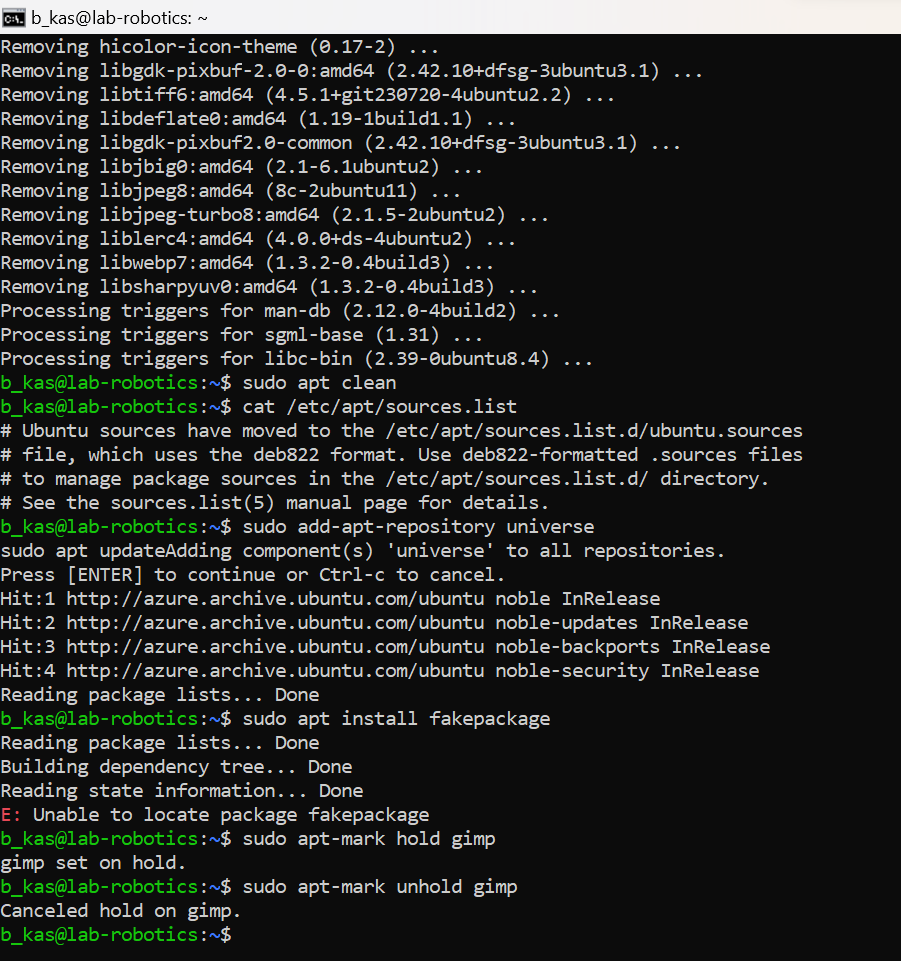 
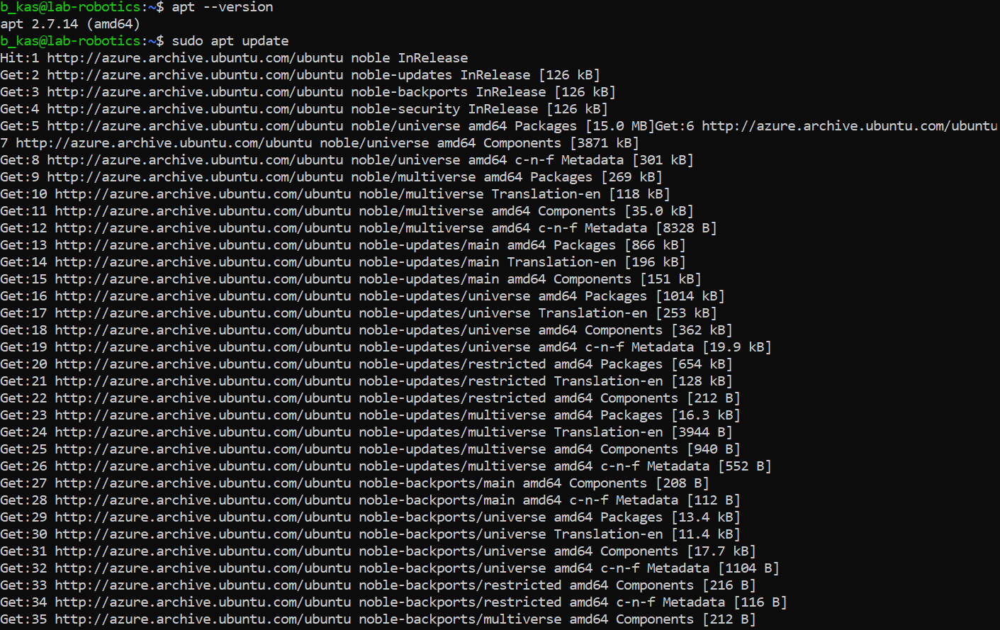 
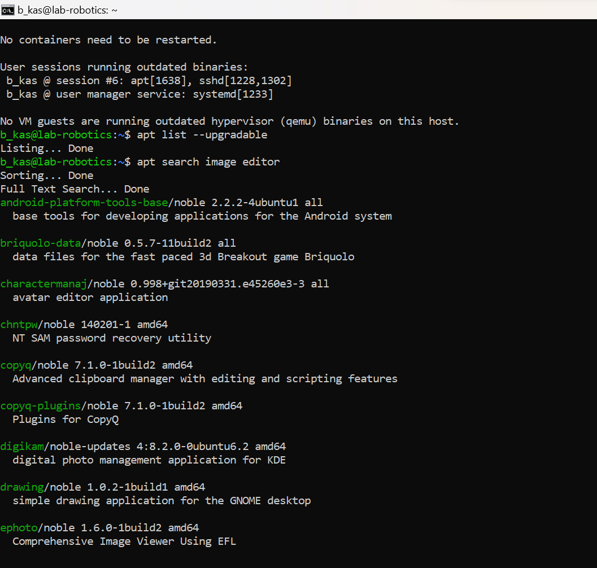


# Assignment 7: Linux Virtualization
## Part 1: Virtualization Concepts
Virtualization

The process of creating a virtual version of something, such as hardware, storage, or network resources.

Hypervisor

Software that creates and manages virtual machines (VMs). Examples include KVM, VMware, and Hyper-V.

Virtual Machines (VMs)

Emulations of physical computers that run their own operating systems.

Containers

Lightweight, isolated environments that share the host OS kernel but have their own file systems and libraries.
### **VMs vs Containers**

- The difference between VMs and Containers in terms of Architecture, Resource Utilization and Isolation

| **Aspect**    | **VMs**                                          | **Containers**    |
|----------------------|------------------------------------------------|------------------------------|
| **Architecture**     | Requires a full OS for each instance            | Shares the host OS kernel      |
| **Resource Utilization** | Requires more resources                        | More lightweight and efficient   |
| **Isolation**        | Provides strong isolation since each VM has its own OS | Provides a lower level of isolation, as it shares the host OS kernel |

 

## Part 2: Multipass Implementation

### Installation

```bash
sudo snap install multipass
```


1. Launch a default Ubuntu instance

```bash
 multipass launch --name basyal-vm
```


2. List all running instances

```bash
multipass list 
```
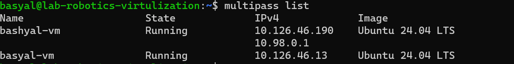

3. View details about an instance

```bash
 multipass info basyal-vm
```
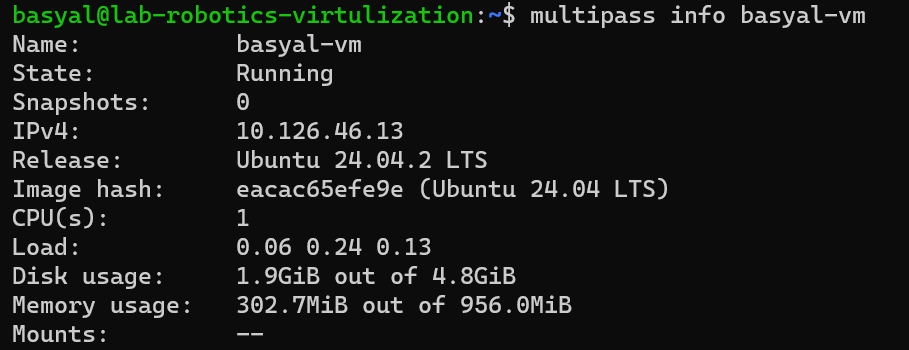

4. Access the shell of a running instance
```bash
multipass shell ajit-vm
```
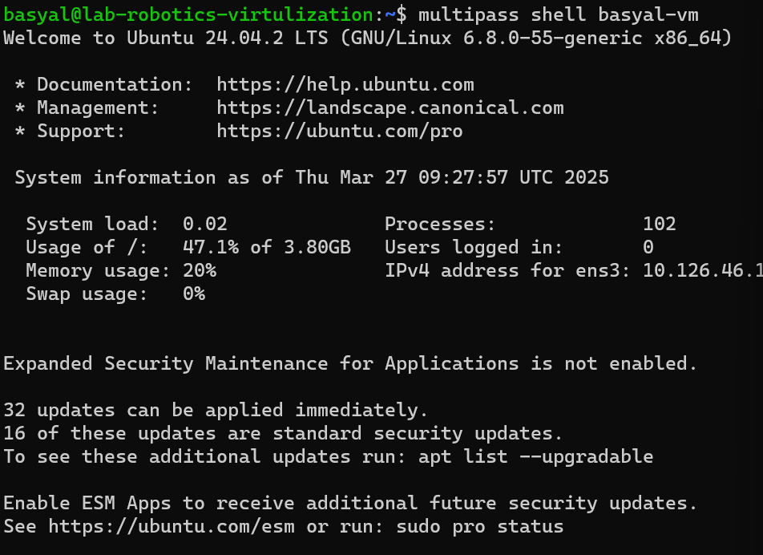

5. Stop, delete and purge an instance
```bash
multipass stop bashyal-vm
```
```bash
multipass delete bashyal-vm
```
```bash
multipass purge
```

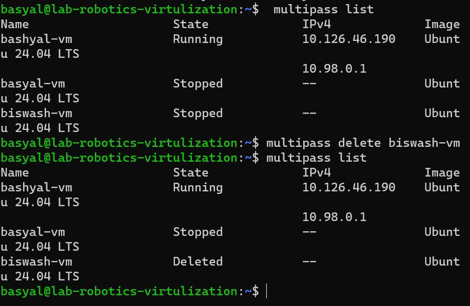

## Learn About Cloud-Init Configuration

Create a cloud-init.yaml file to customize an instance.
```bash
nano cloud-init.yaml
```
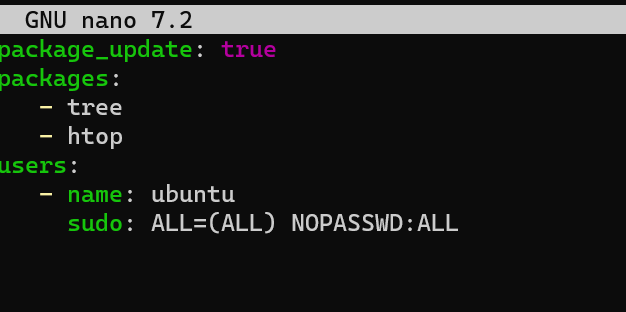

Launch an instance with cloud-init

```bash
multipass launch --name ajit-vm --cloud-init cloud-init.yaml
```


6.Create a new folder and Mount the folder inside a VM:

```bash
mkdir ~/multipass_shared
multipass mount ~/multipass_shared basyal-vm:/mnt/shared
```


I create a txt file inside multipass folder to share it in VM because without creating a file I can't mount the folder.

```bash
echo "Hello, World!" > ~/multipass_shared/testfile.txt
```


Check the mounted folder inside the VM:
```bash
multipass shell ajit-vm
ls /mnt/shared
```
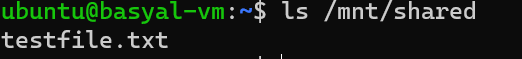

## Part 3: LXD Implementation
Installiation 

First, install Snapd if it's not already installed:
```bash
sudo apt update
sudo apt install snapd
```
Install LXD using Snap
```bash
sudo snap install lxd
```
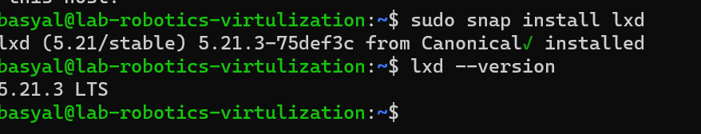

Basic LXD command

1.Create a new container ans list it
```bash
lxc launch ubuntu:24.04 basyal-container
lxc list
```
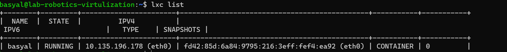

2. Start and stop the container

```bash
lxc start basyal
lxc stop basyal
lxc list
```
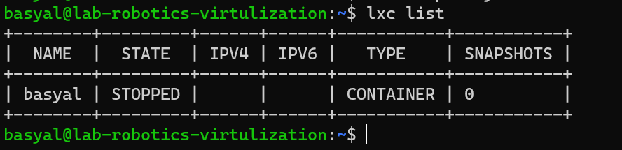

3. Delete the container
```bash
lxc delete basyal
lxc list
```
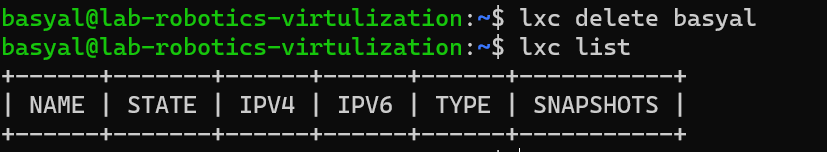

## Part 4: Docker
Installation

```bash
sudo apt update
sudo apt install docker.io
```
Verify the installation

```bash
docker --version
```


Making directory and create nano file

```bash
mkdir myapp
cd myapp
echo "hello world" > index.html
```
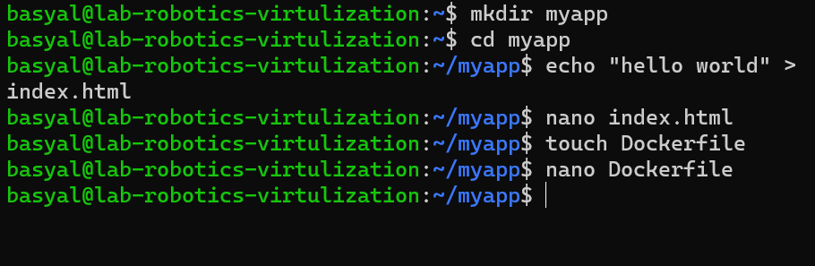

Run Docker
```bash
docker ps
docker run -p 8080:80 bikash-basyal
```

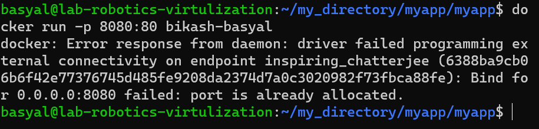


